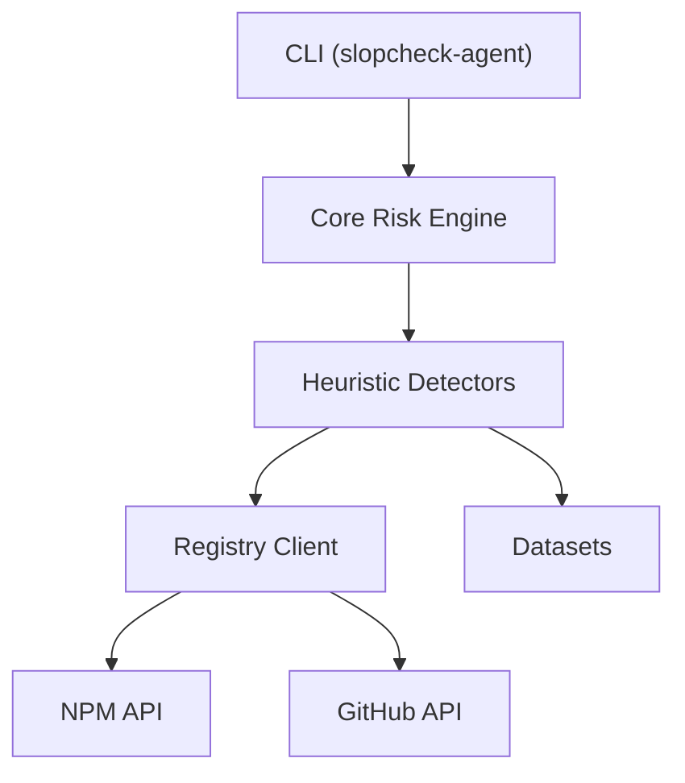

# Slopcheck Agent

AI-native npm supply-chain security for detecting hallucinated, typosquatted, and suspicious packages before they enter your project.

**Node.js**: `>=20`

---

## The Problem

AI coding agents can generate package names that do not exist. Attackers monitor these hallucinations and register the missing packages. If an autonomous coding agent or an unsuspecting developer installs the package without human verification, the attacker-controlled package can silently enter the software supply chain.

**The Attack Path:**
AI-assisted development 
↓
Hallucinated package name generated 
↓
Attacker registers package on npm 
↓
Agent/Developer installs dependency 
↓
Supply-chain compromise

---

## The Solution

Slopcheck Agent is a proactive security tool that analyzes package risk **before** installation or execution. By evaluating multiple heuristics, Slopcheck identifies potentially malicious packages.

**Current Detection Capabilities:**
* **Package Age**: Flags newly published packages with no established history.
* **Download Activity**: Identifies unusually low download volume or artificial inflation.
* **Repository Metadata**: Verifies the presence and quality of source code repository links.
* **Metadata Quality**: Checks for missing descriptions, readmes, or suspicious maintainer information.
* **Hallucination Datasets**: Cross-references against official and community datasets of known hallucinated package names.
* **Similarity / Typosquatting**: Detects if a package name is suspiciously similar to popular npm packages.

*(Note: Slopcheck Agent analyzes metadata and signals; it does not currently perform static or dynamic malware analysis of package contents.)*

---

## Quick Start

> **Note**: Slopcheck Agent is currently in development / pre-release.

Once officially published, you can install it globally:

```bash
npm install -g slopcheck-agent
```

For local development usage, refer to the [Development](#development) section below.

---

## Usage

### Check a Package
Analyze a single npm package for risks.
```bash
slopcheck-agent check <package>
```
*Options:*
* `--json`: Output results in JSON format.

### Scan Dependencies
Scan all dependencies declared in a `package.json` file.
```bash
slopcheck-agent scan package.json
```
*Options:*
* `--json`: Output results in JSON format.

### Explain Scoring
Get a detailed breakdown of how the risk score was calculated for a specific package.
```bash
slopcheck-agent explain <package>
```

### Environment Diagnostics
Check your environment connectivity, Node.js version, dataset availability, and risk engine configuration.
```bash
slopcheck-agent doctor
```

---

## Example Output

```text
$ slopcheck-agent check suspicious-package

Package: suspicious-package

Risk Score: 87/100
Level: HIGH

Findings
────────────────────────────
⚠ Package is very new
⚠ Extremely low download activity
⚠ Repository information is missing
⚠ Similar to a popular npm package

Recommendation:
Do not install until the package provenance is verified.
```

---

## Explainability

Security decisions should be understandable, not a mysterious black box. The `explain` command provides a transparent breakdown of how the final risk score was calculated across different heuristics.

```text
$ slopcheck-agent explain suspicious-package

Detector                 Contribution
──────────────────────────────────────
Package Age                  +15
Popularity                   +20
Repository                   +10
Similarity                   +25
Hallucination                +30

Final Risk Score: 100/100
```

---

## CI/CD and JSON

Slopcheck Agent provides a `--json` flag to generate deterministic, machine-readable output. 

```bash
slopcheck-agent check suspicious-package --json
```

This makes it easy to integrate into:
* CI/CD pipelines
* GitHub Actions
* Security automation scripts
* AI agents (as part of dependency validation workflows)

The CLI uses strict exit codes:
* **0**: Successful analysis with no blocking risk (SAFE or SUSPICIOUS).
* **1**: HIGH or CRITICAL risk detected.
* **2**: Analysis error, unavailable metadata, or package not found.

---

## How It Works



* **CLI**: The command-line interface handling user input and structured output.
* **Core**: The Risk Engine that aggregates signals and calculates the final score.
* **Detectors**: Plugin-based heuristics (Age, Popularity, Similarity, etc.).
* **Registry & Datasets**: Clients to fetch remote metadata and check against known hallucination lists.

---

## Detection Pipeline

The security pipeline operates in a sequential, explainable manner:

```text
Package Name
   ↓
Registry Metadata Retrieval (npm, GitHub)
   ↓
Dataset Lookup (Known Hallucinations)
   ↓
Heuristic Detectors (Age, Popularity, Similarity)
   ↓
Risk Scoring (Weighted Aggregation)
   ↓
Explainable Assessment (Levels: SAFE, SUSPICIOUS, HIGH, CRITICAL)
```

This decoupled architecture allows the community to easily write and integrate new threat detectors.

---

## Security Model

**What Slopcheck Detects:**
* High-risk supply chain signals (typosquatting, hallucinations, missing repositories, extremely new packages).
* Metadata anomalies that indicate untrustworthy origin.

**What Slopcheck Does NOT Detect:**
* **Malware**: It does not scan code for malicious payloads.
* **Vulnerabilities**: It does not replace CVE scanners (like `npm audit`).

**Interpreting Scores:**
* Risk scores highlight the probability of a supply chain attack based on origin signals. 
* Unavailable data (e.g., missing GitHub repo) is treated as a risk factor, not as "SAFE".
* **Always review critical dependencies manually** before integrating them into production code.

---

## Comparison

| Capability                     | Slopcheck Agent | Traditional Audit (npm/pnpm) |
| ------------------------------ | :-------------: | :--------------------------: |
| Hallucinated package detection |               ✓ |                      Limited |
| Typosquat detection            |               ✓ |                      Depends |
| Package metadata heuristics    |               ✓ |                       Varies |
| AI-agent focused workflow      |       Planned/✓ |              Usually limited |
| Explainable findings           |               ✓ |                       Varies |
| CVE Vulnerability Scanning     |     Out of scope|                            ✓ |

---

## Why Slopcheck?

* **AI-Native Context**: Specifically designed to catch AI-hallucinated packages before they do harm.
* **Explainable Scoring**: Transparent risk calculation, not a black-box verdict.
* **Modular Architecture**: Easy to extend with custom detectors.
* **CLI-First**: Native JSON support and standard exit codes make it CI/CD and automation ready.

---

## Roadmap

### Current (Implemented)
* Package risk analysis
* Hallucination datasets (community & official)
* Similarity/typosquat detection
* Registry analysis (npm, GitHub)
* Explain command
* Doctor diagnostics
* JSON output for automation

### Planned (Future Work)
* GitHub Action
* MCP (Model Context Protocol) integration
* Claude Code & Cursor integration
* AI Agent middleware
* Organization policies
* Community threat intelligence feeds
* Deep static analysis/malware detection

---

## Architecture for Contributors

Slopcheck Agent is a pnpm monorepo consisting of highly decoupled packages:

```text
packages/
├── cli        # Command-line interface and commands
├── core       # Risk Engine, plugin registry, and types
├── registry   # npm and GitHub API clients with caching
├── heuristics # Implementation of all detector plugins
├── datasets   # Official and community hallucination data
└── config     # Shared TypeScript/build configurations
```
*(For deeper details, refer to `docs/architecture.md`)*

---

## Development

To set up the project locally:

```bash
# 1. Install dependencies
pnpm install

# 2. Build all workspace packages
pnpm build

# 3. Typecheck
pnpm typecheck

# 4. Lint
pnpm lint
```

To run the CLI locally during development:
```bash
node packages/cli/dist/index.js check express
```

---

## Testing

Slopcheck uses `vitest` for fast, workspace-aware unit testing.

```bash
# Run all tests across the monorepo
pnpm test
```

---

## Contributing

1. Fork the repository
2. Clone your fork: `git clone https://github.com/your-username/slopcheck-agent.git`
3. Install dependencies: `pnpm install`
4. Create a feature branch: `git checkout -b feature/my-detector`
5. Make your changes and run tests: `pnpm test`
6. Open a Pull Request!

See [CONTRIBUTING.md](CONTRIBUTING.md) for more details.

---

## Security

If you discover a security vulnerability in Slopcheck Agent, please do not disclose it publicly. Refer to our [SECURITY.md](SECURITY.md) for responsible disclosure instructions.
